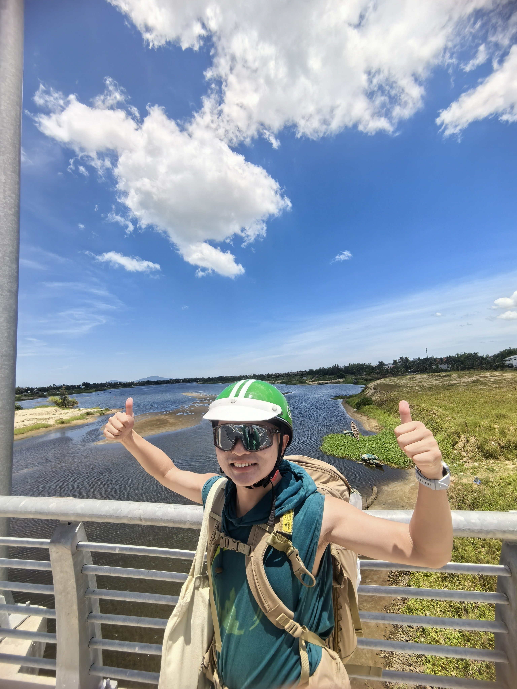
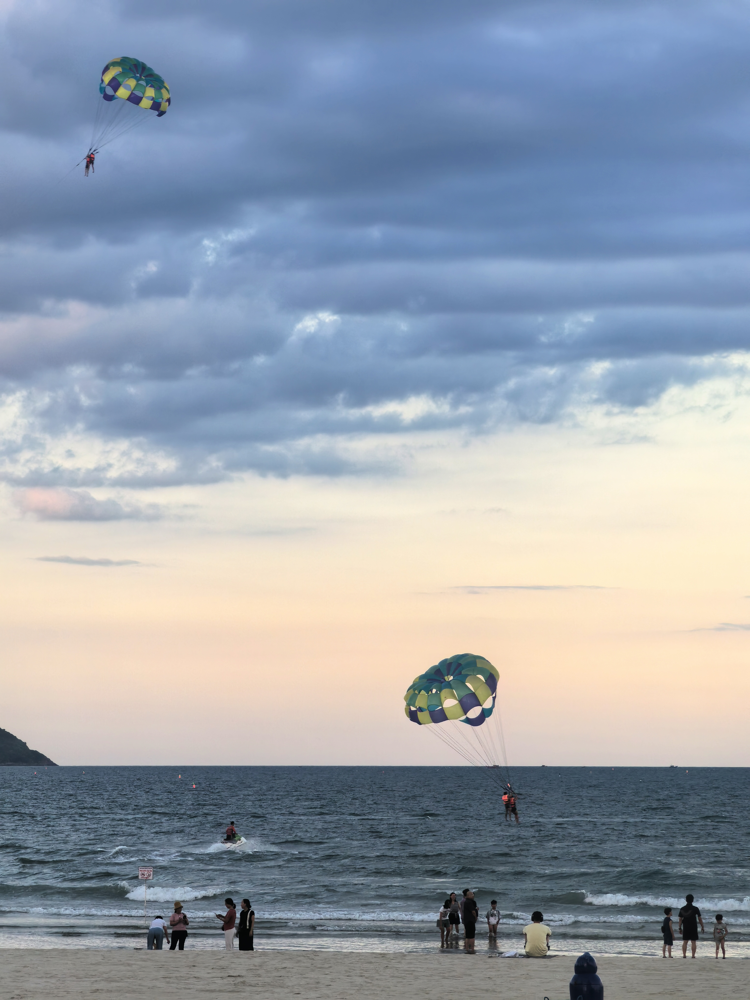
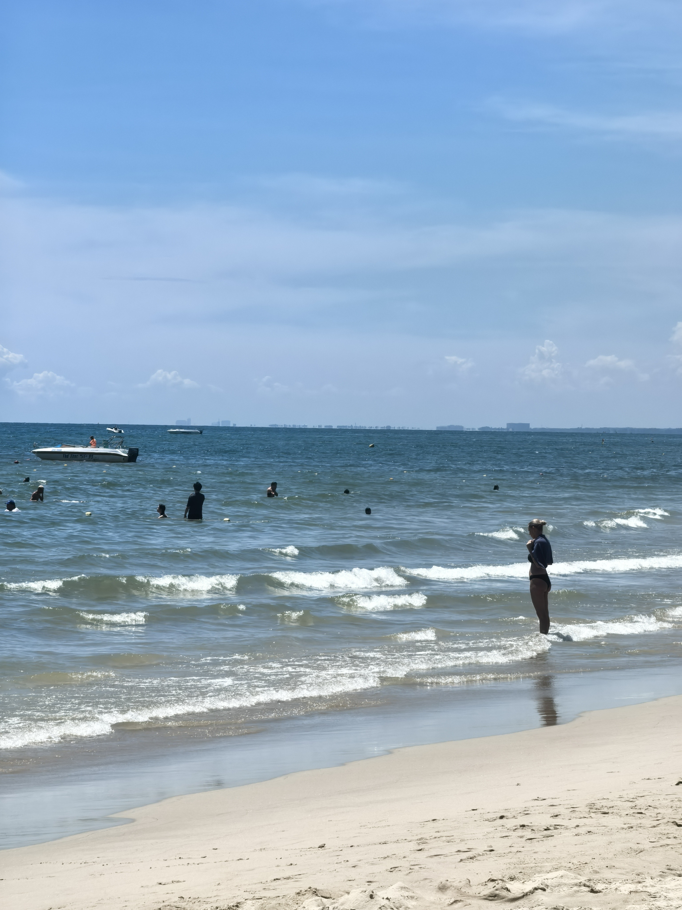
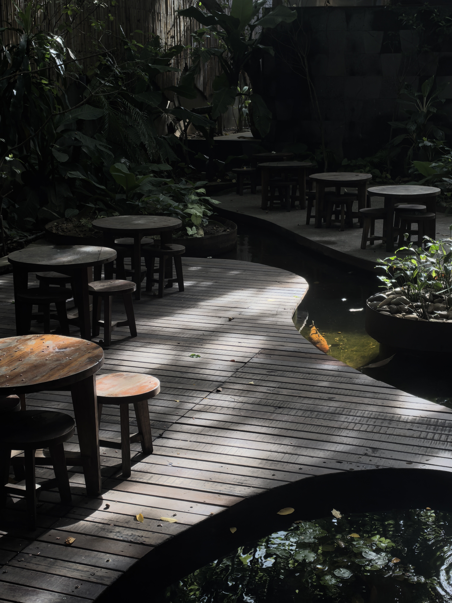

# 第五章 岘港：过渡

*「亚洲最美沙滩旁边，我在想为什么咖啡的外皮也能泡茶」*

**2025.8.20 — 8.27**

---

## 5.1 美溪沙滩

据说是亚洲最美沙滩之一。

我站在那里，看着白色的浪打上来，再退回去。重复，再重复。

沙滩的美，不在于它有多壮观，而在于它把你的思绪洗空。你很难在海浪声里继续想那些未完成的事情，很难让焦虑在浪声里站稳。

我在这里跑步，游泳，什么都不做。

岘港在地理上是一个过渡——北边是会安和顺化，南边是大叻和芽庄。它本身没有会安那种历史浓度，也没有大叻那种安静，但有它自己的节奏：更现代，更直接，更不在乎给人留下什么印象。

  
  

    
    
  

---

## 5.2 Cascara Tea：另一种理解咖啡的方式

在岘港一家叫 WONDERLUST 的咖啡馆，我喝到了 Cascara Tea。

咖啡豆来自咖啡樱桃。通常被使用的是里面的种子——也就是咖啡豆本身。但咖啡樱桃的外皮和果肉，晒干之后，可以泡成茶。

这就是 Cascara。

味道介于茶和水果茶之间，有点酸甜，带着淡淡的咖啡香，但没有咖啡的苦。喝着像玫瑰果茶加了一层咖啡果实的气息。

我端着那杯茶，想到一件事：

**我们习惯把东西分成「有用」和「没用」，然后只使用「有用」的部分，把「没用」的丢掉。** 咖啡豆的外皮，在「咖啡逻辑」里是废料，但在「茶的逻辑」里，它是原料。

这不只是咖啡的问题。

你当年的「失败」，在你正在走的这条路的逻辑里可能是废料，但在另一条逻辑里，也许是某种特别的起点。问题不是那些「废料」本身，而是你用什么框架来理解它们。

---

## 5.3 NAM House：时间的回响

在岘港还有一家咖啡馆，叫 NAM House。

复古风格，老木头，旧唱片，有年代感的家具。放着越南老歌——很慢，很轻，像回到很多年前的某个地方。不是老上海，也不完全是旧越南，是一种混合的、模糊的过去时态。

坐在那里，一种奇怪的时间感包围过来。

我不确定这种「怀旧感」是真实的还是设计出来的。但我意识到：这两件事并不矛盾。设计出来的怀旧，也可以触发真实的情感回应。你听到那首歌，脑子里浮现出的记忆是真实的，哪怕触发它的场景是被设计的。

**情感的真实性，不取决于触发它的事物是否真实。**

我在 NAM House 坐了两个小时，什么也没想，只是听着歌。出门的时候，觉得时间过了很久，但也觉得时间过了很短。

  
  

岘港是一个过渡，但这个过渡很重要——它让我从会安的情绪密度里走出来，在到达顺化之前，先安静一会儿。
