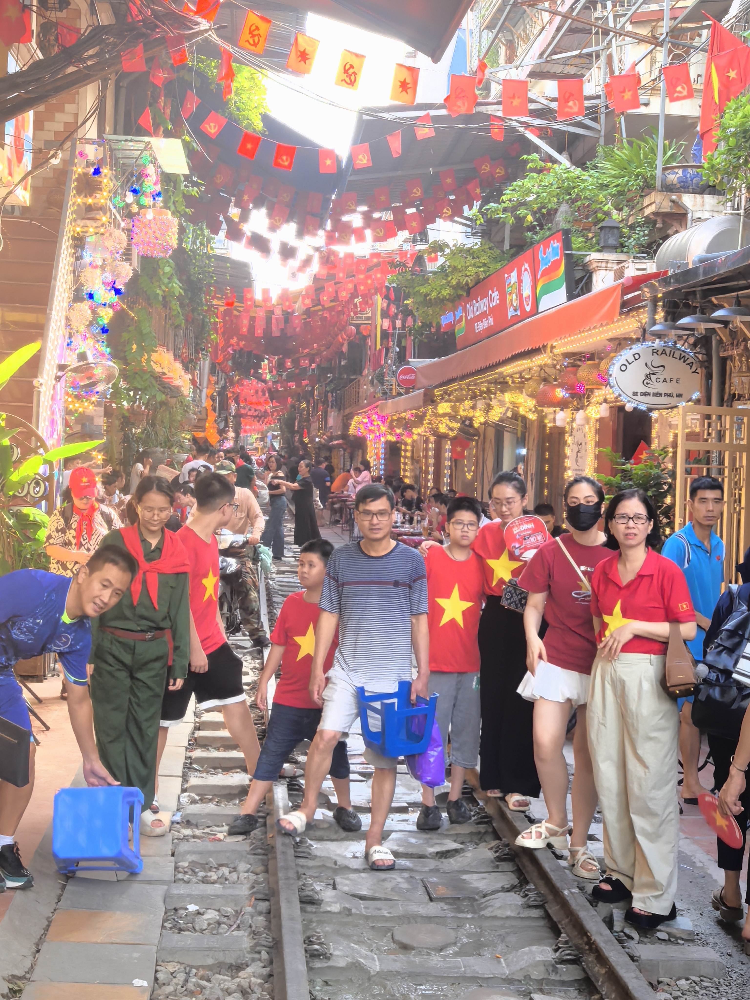
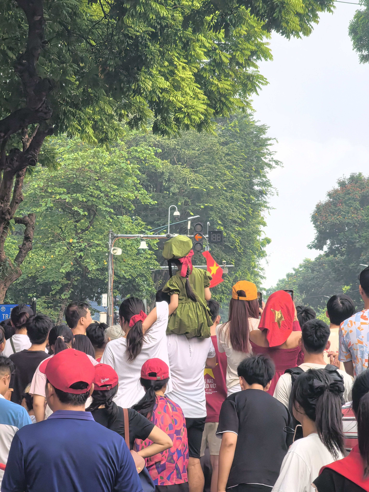
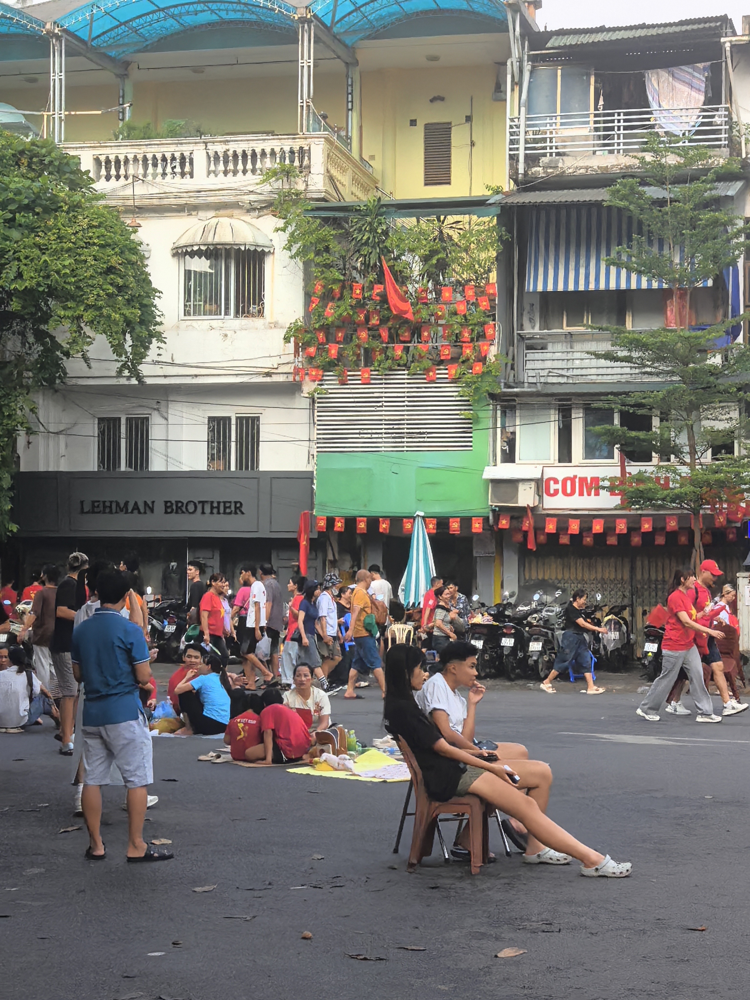
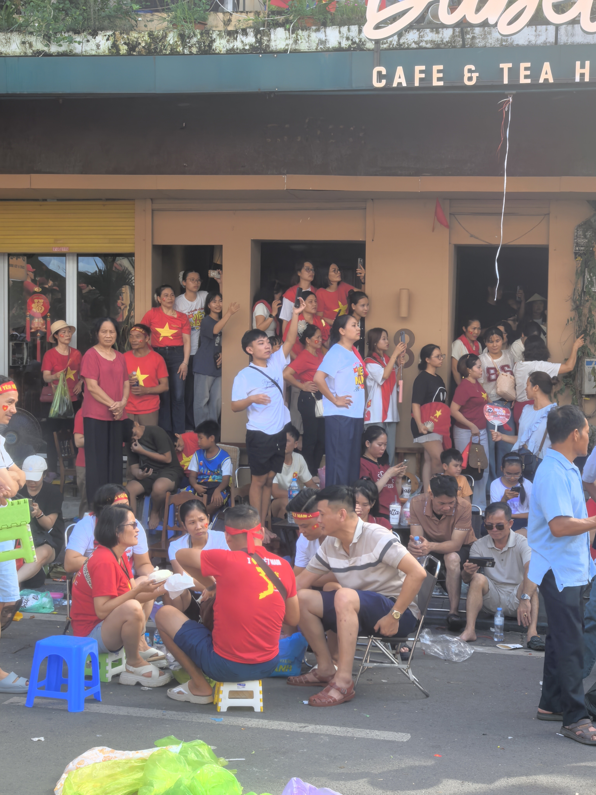
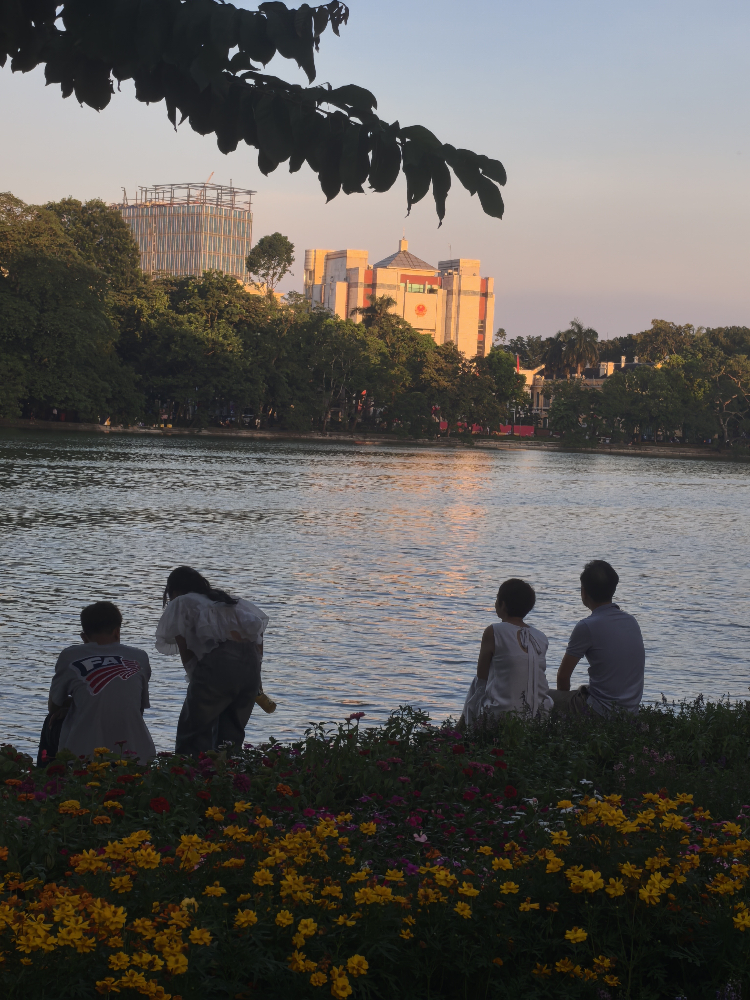

# 第七章 河内：叙事

*「一场阅兵，让我理解了为什么越南的国庆节上，学生方阵有人笑场，没有人觉得有什么不对」*

**2025.9.1 — 9.10**

---

## 7.1 到达：另一个越南

河内是夜里到的。

下了大巴，空气不一样了。比胡志明凉，也比胡志明重——不是温度的重，是一种说不清的密度。街道更窄，树更多，路灯泛黄。摩托车依然到处都是，但声音好像有节制了一点，或者说，它们懂得适可而止。

我站在大巴站出口，拖着行李，找了很久 Grab。那一刻我想：这座城市正在用它自己的方式说——欢迎，但别以为你懂我。

---

## 7.2 还剑湖与三十六行街

河内老城有个地方叫「三十六行街」。名字听起来像历史遗迹，但实际上，它是一个活着的商业区。每一行代表一种行业——行银是银器街，行麻是纺织品街，行糖是糖果街。

这种命名方式和商业聚集模式，可以追溯到十五世纪。来自全国各地的商人聚集在升龙（河内的古称）做生意，逐渐形成了按行业聚集的传统。

这个传统延续到今天，不是因为它被保护起来了，而是因为它一直有用。

银器店还在卖银器，布料店还在卖布料，糖果店还在卖糖果。这不是博物馆，是生活本身。

**有些东西能传承几百年，是因为它必须有用。不是作为遗产被保护，而是作为工具被使用。**

---

## 7.3 国庆节：叙事的底色

9 月 2 日，越南国庆节。河内。

学生方阵、工人方阵、少数民族方阵，每个人都在笑。

和我在国内见过的阅兵气质完全不同——那边的感觉是「这是国家在展示自己」，这边的感觉是「这是我们国家的生日，我来了」。

学生方阵有人笑场了，没人觉得有什么不对。工人方阵步伐不齐，旁边观众拍手叫好。

我站在人群里，一个旁观者，突然有一点羡慕。

羡慕的不是越南的制度或经济，而是那种朴素的**叙事所有权**——「这是我们的故事，我们是主角」。

  
  
  
  

越南的独立不是外面送来的，是他们自己打下来的。胡志明领导的民族主义运动，武元甲指挥的游击战和持久战——这场战争的胜利根植于广大人民的参与，而不是依靠外部大国的恩赐。

所以国庆节的叙事里，每个人都感觉自己是这个故事的一部分，不是观众。

---

> 叙事是意义框架。没有叙事，事实就只是孤立的信息。有了叙事，事实就是有方向的故事。
>
> 事实 → 叙事 → 信念 → 行动。这是人类心理常见的路径。
>
> 大家的人生叙事不一样——有的人把自己的人生理解为生存挣扎，有的人理解为一场有趣的探索，有的人理解为使命感。叙事不同，带来的体验截然不同。

越南国庆节的叙事，是自下而上的——「我们是自己国家的主人」，叙事里每个人都是主角，所以人们来参与，而不是来观看。

这也让我想到一个更大的问题：在算法时代，谁是你自己故事里的主角？

算法持续地在给你讲一个关于「你是谁、你喜欢什么、你应该看什么」的故事。它比任何人都更了解你的行为数据。大多数人不知道自己正在被叙事。

**悬浮感的一部分原因，也许就是：失去了自己故事里的主角位置。**

---

## 7.4 喝醉那晚：摘掉的那副眼镜

旅程快结束的某个周六，在河内，我跟着青旅的一群人去了酒吧街。

所有人都在喝，在跳，在大声说话。空气里是那种集体放纵的气味。

我喝了很多。然后我坐在角落里，感到一种奇怪的格格不入。

不是因为我融不进去——我可以融入，我知道怎么做这些。而是醉意把我平时用来「适应」的那层东西摘掉了，于是我突然看见了：**所有人都在扮演一个「在越南玩得很嗨的背包客」的角色，包括我。**

对面的西班牙人说：「你好像很累。不是身体，是那种一直在想的累。」

我说还好。

他说：「不像还好。」

后来某个时刻，我低着头，不知道在想什么，眼眶热了一下。不是大哭，是某个东西松开了一点。他假装没看见。

那天夜里我写了一条笔记：

> 喝醉了一点。哭了一下。不知道为什么。
>
> 可能是因为这两个月太用力了。太用力地在观察，太用力地在思考，太用力地在「不浪费」这趟旅行。好像稍微松开一下，就不值得来了似的。

醉意让我暂时摘掉了那副用来适应的眼镜。那一刻我看到了：我们都是演员，包括我自己。

  
  

然后又写了一句：「只有那些感到格格不入的人，才有可能真正改变什么。」

---

格格不入不是优越感。是一种孤独的清醒——你看见了场域里每个人在扮演的角色，包括你自己。这种看见是不舒服的，但它是真实的。

AI 永远不会格格不入。它是终极适应者，永远配合，永远输出，永远在线。

**算法不会在所有人狂欢的夜晚，一个人坐在角落里感到不真实。**

但人会。

那种不适感——那种「这个世界好像不属于我」的感受——不是 bug，是 feature。是你的脆弱性在告诉你：你是一个真实的、有限的、在场的生命。

---

## 7.5 AI 把效率推到极限之后，人还剩什么？

坐在河内某个露天咖啡馆的小塑料凳上，旁边的越南年轻人在刷抖音，喝着加了一颗冰块的滴漏咖啡。

我想了一个问题：**AI 把效率推到极限之后，人还剩什么？**

不是恐惧的那种问法。是真的想知道。

越南的滴漏咖啡，铝制小壶架在杯子上，热水倒进去，咖啡一滴一滴落下来，整个过程大概五分钟。第一次见我觉得效率很低——为什么要等五分钟？

后来我明白了：那五分钟不是等待，是仪式。它告诉你——**你现在要坐下来了。这五分钟，你在这里。**

在我的日常生活里，你的注意力是数据，你的时间是资源，你的每一段空着的时间都在被争夺入口。越南的咖啡馆给你的，是一种很朴素的东西：**单纯地存在着，不被使用。**

这件事在现代生活里，越来越像一件需要被保护的东西。

AI 可以学习（learning）——处理信息，更新参数，优化输出。但 AI 无法**转化**（transformation）——你经历一些真实的事情，让它触动你的某个部分，在时间里沉淀，最终改变你看世界的角度。

**这个过程不可以被外包。**

AI 给你一个关于自己的答案；旅行给你一个关于自己的问题。

**后 AI 时代，人的优势不是效率，不是知识，不是速度。**

**是那种因为有限、脆弱、在场，才会在普通的夜晚流泪的能力。**

人因为会死，才懂得时间的重量。人因为会孤独，才知道连接的价值。人因为会受伤，才能被另一个人的伤所感动。
